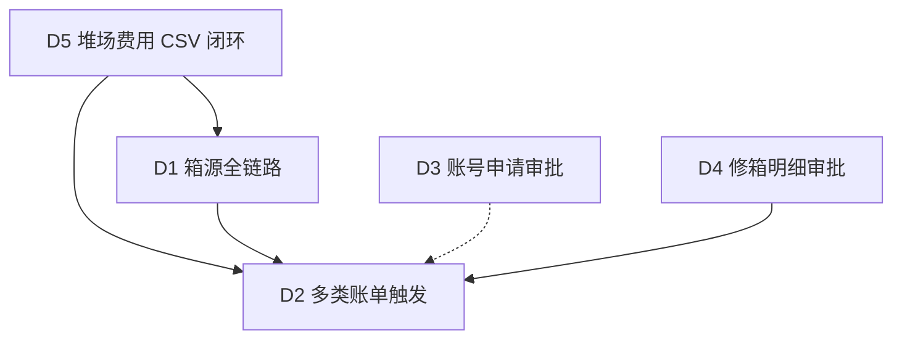

# 批次 D 细化实施清单

对应八月工单 5 条大型需求。本轮目标：**可验收的最小全链路**，不做一次性大重构。  
前置骨架已在 `c7f1f95`：`box-source.ts`、`multi-bill-plan.ts`、`repair-approval-plan.ts`、`user-signup-plan.ts`、`/signup`、堆场费用字段暴露。

---

## 推荐实施顺序（依赖）



| 优先级 | 工单 | 估工期 | 依赖 |
|--------|------|--------|------|
| P0 | D5 堆场费用 | 0.5～1 天 | 无 |
| P0 | D1 箱源全链路 | 1 天 | 订单字段已有 |
| P1 | D4 修箱审批报价 | 1.5～2 天 | 可复用调运审批 |
| P1 | D2 多类账单 | 1～1.5 天 | D5 + D4 部分 |
| P2 | D3 账号申请 | 1～1.5 天 | 独立 |

---

## D5 · FB202608031637205 堆场费用维护 + CSV

### 目标
堆场 `dailyExpenses` / `freeDuration` / `boardingFee` / `alightingFee`（及已有 `secondaryRemovalFee`）可维护、可导入导出，并作为后续计费数据源。

### 已有
- `Yard` 类型字段齐全；编辑表单已露出四费；导出 CSV 可用；导入为 stub。

### 要做
1. **导入闭环**：解析 CSV（表头：堆场名称/编码、日堆存费、免堆天数、上车费、下车费、二次搬移费）→ 按 `name` 或 `factoryCode` 匹配更新，禁止误建重复堆场。
2. **列表列**：台账表增加「日费用 / 免堆 / 上车 / 下车」列（可折叠或次要列）。
3. **校验**：金额 ≥ 0；免堆天数整数 ≥ 0；空单元格保留原值。
4. **（可选本迭代）** 设置页增加「提箱后取消变更费比例」配置键，默认 20%（供 C 取消逻辑读取）。

### 表/迁移
- 无新表；确认生产 `yards` 列已存在（老系统导入应有）。

### 验收
- [ ] 导出 → 改一行费用 → 导入 → 编辑页数值一致  
- [ ] 错误行 toast 汇总，不中断整批已成功行  

### 关单备注建议
`堆场费用字段可编辑；支持费用 CSV 导入导出（按名称/编码匹配更新）`

---

## D1 · FB202608031524915 箱源 自有箱|租赁箱

### 目标
申请可选箱源 → 确认落库 → 放箱/登记箱号时按箱源过滤库存箱；价目暂不强制挂钩（预留 `priceKind`/`boxSource` 扩展）。

### 已有
- `UseBoxOrder.boxSource` + schema 列；申请页可选；`filterInventoryByBoxSource`。

### 要做
1. **订单处理确认**：确认对话框展示/可改箱源，写入 `boxSource`。
2. **登记箱号 / 放箱候选**：`listAvailableUseboxContainers` 增加 `ownership === boxSource` 过滤（订单无箱源则不过滤）。
3. **列表展示**：订单处理、我的订单、单据中心显示箱源 Badge。
4. **默认值**：未选时确认默认可为「自有箱」或空（空=不限）；产品默认建议：**空表示不限**。
5. **供应合同（本迭代不做硬绑定）**：文档注明下一迭代：租赁箱须校验有效供应合同。

### 表/迁移
- `ensure-orders-schema` 已含 `boxSource`；生产 pull 后首次访问订单 API 自动补列。

### 验收
- [ ] 申请选「租赁箱」→ 确认后订单详情可见  
- [ ] 登记箱号时自有箱不会出现在租赁箱订单候选（有数据时）  

### 关单备注建议
`订单/申请支持箱源；确认可改；登记箱号按箱属过滤候选；供应合同联动另迭代`

---

## D4 · FB202608031618876 修箱费用明细 + 审批

### 目标
修箱单增加报价明细行 + 简化审批状态机（先单级箱管审批，预留多级）。

### 已有
- `RepairQuoteLine` / `RepairApprovalStatus` 类型骨架；`repair` 资源与页面。

### 要做
1. **Schema**：`repair_orders` 增加 JSON 列 `quoteLines`、`quoteStatus`、`quoteTotal`、`quoteApprovedBy`、`quoteApprovedAt`、`quoteRejectReason`（幂等 ensure）。
2. **UI（修箱工单页）**  
   - 明细表：费用项 / 数量 / 单价 / 小计 / 删行  
   - 操作：提交报价 → `待审批`；箱管通过/驳回  
3. **状态机（裁剪版）**  
   `待报价 → 待审批 → 已通过 | 已驳回 →（驳回可改明细再提）`  
   - 角色：现场/箱管可填报价；`R00/R01` 审批  
4. **通过后钩子（对接 D2）**：调用 `generateRepairBill` 生成维修费账单（金额=合计）。

### 表/迁移
```sql
-- 示意，实际用 ensure-repair-schema 幂等
ALTER TABLE repair_orders ADD COLUMN quoteLines JSON NULL;
ALTER TABLE repair_orders ADD COLUMN quoteStatus VARCHAR(20) NULL;
ALTER TABLE repair_orders ADD COLUMN quoteTotal DECIMAL(12,2) NULL;
...
```

### 验收
- [ ] 可录入多行明细并汇总  
- [ ] 提交后箱管可驳回/通过；通过生成维修费账单（若 D2 已合并 BillType）  

### 关单备注建议
`修箱支持报价明细与箱管审批；通过后可出维修费账单`

---

## D2 · FB202608031545389 多类账单

### 目标
扩展账单类型并在节点触发生成。

### 新类型（并入 `BillType`）
| 类型 | 触发点 | 金额来源 |
|------|--------|----------|
| 维修费账单 | 修箱报价审批通过 / 完工 | `quoteTotal` |
| 上下车费账单 | 确认放箱或确认收箱（可配置） | 堆场 `boardingFee`/`alightingFee` × 箱量 |
| 异常费账单 | 异常进出场「确认计费」或箱管手工 | 表单填写 / CSV 行金额 |

### 要做
1. 扩展 `BillType` + 账单列表筛选/Badge。  
2. 实现 `generateRepairBill` / `generateBoardingAlightingBill` / `generateAbnormalBill`（替换 stub）。  
3. 触发挂接：  
   - repair 审批通过 → 维修费  
   - confirm-pickup / confirm-return（可选开关，默认**仅还箱收上车+还箱下车**或按作业一次）→ 上下车费；同订单同类型幂等去重  
   - 异常池操作「生成异常费」→ 异常费  
4. 客户账单页只读可见；箱管可调金额（复用现有调整流）。

### 验收
- [ ] 审批通过修箱后出现维修费账单  
- [ ] 堆场有上车费时，作业节点生成上下车费且不重复  
- [ ] 异常池可手工出异常费  

### 关单备注建议
`账单新增维修费/上下车费/异常费；分别在修箱审批、提还箱作业、异常池触发生成`

---

## D3 · FB202608031616997 账号申请 → 管理员审批

### 目标
公开申请落库 → 管理员审批 → 开通 `users`（默认 R03）并通知。

### 要做
1. **表** `account_applications`：id, name, org, email, phone, remark, status, createdAt, reviewedAt, reviewedBy, rejectReason, createdUserId。  
2. **API**：`POST /api/account-applications`（公开，限流/验证码可后置）；资源 `accountApplications` 仅 R00 读写。  
3. **`/signup`**：提交真正落库，toast「已提交，等待审批」。  
4. **管理页** `/admin/signup-approvals`（或挂在用户管理 Tab）：列表 + 通过/驳回。  
   - 通过：创建 user（账号=邮箱前缀或手机，初始密码随机/发送），写审计。  
5. **ACL**：nav 仅 R00；公开路由不进 dashboard layout。

### 验收
- [ ] 未登录可提交申请  
- [ ] 管理员可见待审；通过后可用新账号登录（R03）  
- [ ] 驳回有原因且不可重复通过同一申请  

### 关单备注建议
`公开账号申请 + 管理员审批开通客户账号（R03）`

---

## 跨项约定

1. **环境**：优先生产改完 → commit/push → 构建重启；开发机 pull。  
2. **安全改码**：中文页只用 StrReplace/Write；列表复用 `useListQuery`。  
3. **关单**：每条完成后生产库 `feedback_tickets.status='已关闭'`。  
4. **不做**：供应合同强制校验、多级修箱审批链、异常费复杂规则引擎——标为「下一迭代」。

---

## 建议下一对话开工指令

> 按批次 D 细化清单，先做 **D5 堆场费用 CSV 导入** + **D1 箱源确认与过滤**，做完 commit/push/生产部署并关对应工单。
