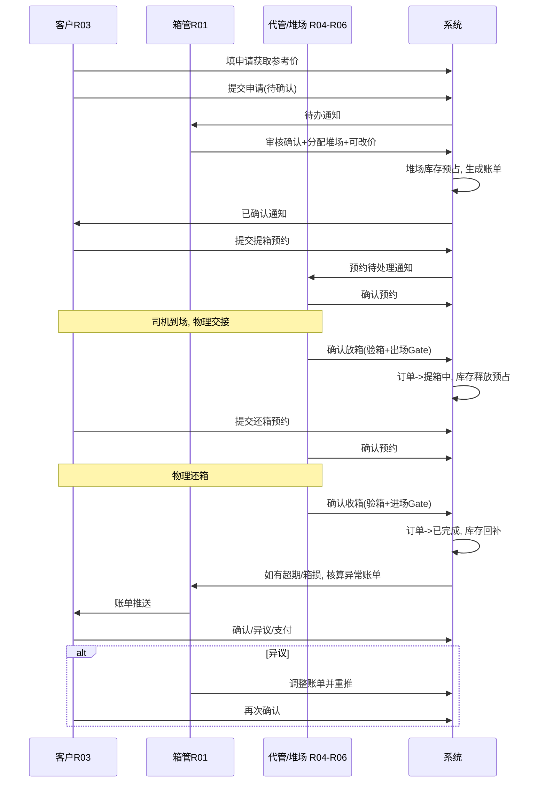
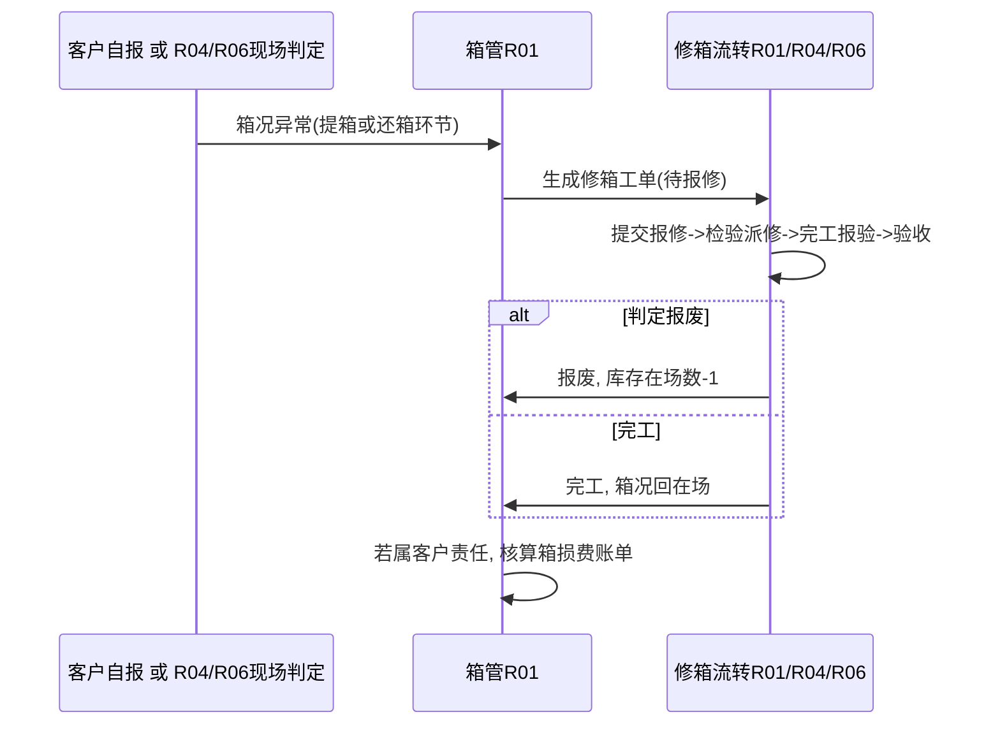

# 客户全生命周期协作流程重设计

> 版本：2026-07-16
> 性质：设计文档，本轮**不改代码**，仅界定客户（R03）与多联公司各角色在用箱核心生命周期中的协作边界，供下一轮排期实现。
> 对照文档：《集装箱业务管理系统功能说明书_V2.md》第二章角色说明、第六章「关键业务规则汇总」BR-01~18；《需求合理化与补齐说明.md》P0/P1 交付清单。
> 范围：用箱申请 → 提箱执行 → 使用 → 还箱执行 → 账单 → 异常/维修（M01 + M04 执行环节 + M06 + 账单）。不含调运（M02）向客户开放可见度。

---

## 0. 现状问题（已核实）

通过代码核查确认当前实现存在以下协作错位：

1. 客户点击「箱况确认 → 通过并上传」「上传还箱证明」会**直接**把订单推进到「提箱中」「已完成」——由客户自己的按钮代替了本应由现场角色执行的确认。
2. R04（代管公司）/ R06（堆场）在预约页只能「发通知」，**没有**「确认放箱 / 确认收箱」这类现场执行动作。
3. `bookings` 状态机中的「已确认」是**死状态**：业务代码从未把预约写成「已确认」，只停在「已通知」。
4. 进出场映射（`gate`）与用箱订单**不联动**——只有调运（M02）的提还箱会创建 `gate` 记录并联动库存，用箱（M01）链路完全绕开这套机制。
5. 账单异议后**仅通知 R01**，没有「箱管调整金额/明细 → 重新推送客户确认」的闭环动作。

**结论**：该由现场角色执行确认的环节，被客户自助按钮越权代替了；这正是本次要纠正的协作设计问题。

---

## 1. 设计原则（电商类比）

| 电商环节 | 本系统对应 | 谁来做 |
| :--- | :--- | :--- |
| 浏览/估价 | 填申请单获取参考价 | 客户自助（系统自动报价） |
| 提交订单 | 提交用箱申请 | 客户自助 |
| 商家确认订单、分配库位 | 箱管审核、分配提/还箱堆场、可改价（**已实现**，见用箱确认流程改造） | 后台 R01 |
| 选择收货时间窗口 | 提箱/还箱预约（受工作时段/提前量校验） | 客户自助，系统强校验 |
| 仓库揽收/出库扫描 | **堆场确认放箱**（验箱+创建出场记录） | 现场 R04/R06（**待新增**） |
| 退货验收入库 | **堆场确认收箱**（验箱+创建进场记录） | 现场 R04/R06（**待新增**） |
| 异常报备/售后工单 | 箱况异常 → 修箱工单 | 客户自报或现场判定，R01/R04/R06 处理 |
| 账单/发票与催收 | 账单确认/异议/支付 | 客户自助 + R01 后台调整闭环（**已交付 BR-22**） |

**核心原则**：客户只对"自己的意愿与资料"负责（申请、预约时间、随箱资料、账单确认/异议）；凡涉及"物理箱况核实与库存变动"的动作，必须由到场的后台角色（R04/R06）执行确认，系统据此推进订单状态——而不是客户自证自推。

---

## 2. 全生命周期职责矩阵

| 阶段 | 客户（R03）自助 | 后台/现场执行 | 系统自动 | 状态产出 |
| :--- | :--- | :--- | :--- | :--- |
| ① 咨询报价 | 填线路/箱型/数量，获取参考价 | 无 | 按箱型/线路给参考单价 | 报价（未落单） |
| ② 提交申请 | 提交申请（带报价快照） | R01 收到待办 | 生成订单号，状态=待确认 | Order(待确认) |
| ③ 审核确认与资源预占 | 等待 | R01 审核、分配提/还箱堆场、可改价+备注 | 在所选堆场做库存**预占**（`reserved+=`，`available-=`）；生成用箱账单 | Order(已确认) + 库存预占 + Bill(待确认) |
| ④ 提箱预约 | 选提箱时间窗口（受限校验）并提交 | **R04/R06 接受预约**（新增「确认预约」动作） | 工作时段/提前量强校验 | Booking(已确认) |
| ⑤ 提箱执行（现场） | 司机到场；上传自己的装箱单(stuffing list) | **R04/R06「确认放箱」**：验箱（通过/异常）、创建出场 Gate、扣减该堆场 `reserved`/`onSite` | 放箱确认后**自动**把订单推进「提箱中」；异常则转⑨ | Gate(出场) + Order(提箱中) |
| ⑥ 在用期 | 查看状态、下载提箱单副本 | 监控超期（沿用现有规则） | — | — |
| ⑦ 还箱预约 | 提交还箱预约（≥24h+工作时段） | R04/R06 接受预约 | 同④ | Booking(已确认) |
| ⑧ 还箱执行（现场） | 物理交箱；可上传自己的还箱说明（存档，不驱动状态） | **R04/R06「确认收箱」**：验箱、创建进场 Gate、回补 `onSite`/`available` | 收箱确认后**自动**把订单推进「已完成」；异常则转⑨；产生超期/箱损/变更费则 R01 核算异常账单 | Gate(进场) + Order(已完成) |
| ⑨ 异常处理 | 可自报箱况异常（提箱/还箱均可） | 通知 R01(+R04)；创建修箱工单；R01/R04/R06 流转至完工/报废；属客户责任则核算箱损费 | 自动建修箱单+通知 | Repair 工单闭环 |
| ⑩ 账单结算与异议 | 查看/确认/异议/支付账单 | **R01「调整账单」**（改金额/明细/备注，重置待确认+新截止）或维持原金额说明理由，循环直至客户确认 | 3 天未反馈自动「超时默认确认」（沿用 BR-08） | Bill 闭环 |

---

## 3. 主链路顺序图

---

## 4. 异常分支（箱况异常 → 修箱）

---

## 5. 关键状态机变更点

| 对象 | 现状 | 重设计后 |
| :--- | :--- | :--- |
| `bookings.status` | 待发送→已通知（终态，「已确认」死状态） | 待发送→已通知→**已确认**（R04/R06 接受预约时写入，新增动作与字段 `confirmedBy`/`confirmedAt`） |
| `orders.status`（已确认→提箱中） | 客户点「箱况确认→通过并上传」直接推进 | 由 **R04/R06「确认放箱」** 动作推进；客户按钮改为「上传随箱资料」（不改状态），若客户自报异常仅**标记**、不越权推进 |
| `orders.status`（提箱中→已完成） | 客户点「上传证明」直接推进 | 由 **R04/R06「确认收箱」** 动作推进；客户上传证明仅存档 |
| 库存 `reserved`/`onSite`/`available` | 用箱链路不预占，不与 gate 联动 | 确认订单时**预占**（分配堆场维度）；放箱确认时预占→onSite 转出；收箱确认时 onSite/available 回补（复用调运 M02 已有的 `createGate`+库存联动模式） |
| `bills` 异议 | 仅通知 R01，无后续动作 | 新增 R01「调整账单」：改金额/明细/备注→重置为待确认+新 `confirmDeadline`→再通知客户；循环直至确认/支付/超时默认确认 |

---

## 6. 权限与数据模型影响（设计层面，供后续实现参考）

- **ACL**：R04/R06 对 `orders` 由「不可写」调整为「受限写」——仅可写 `conditionCheck`/`conditionNote`/执行态 `status` 迁移与关联 `gate` 创建，不可写价格/客户信息/取消；并按分配堆场归属做租户隔离（参照现有 R05 按 `carrier` 过滤 `dispatch` 的模式）。
- **新增字段建议**：
  - `Booking.confirmedBy` / `confirmedAt`
  - `UseBoxOrder.pickupGateBy` / `pickupGateAt`、`returnGateBy` / `returnGateAt`（现场确认人/时间留痕）
  - `Bill.disputeReason`、`adjustedBy`（异议与调账留痕）
- **BR 编号建议**（新增 BR-19~22，供后续写入《需求合理化与补齐说明》）：
  - **BR-19**：提/还箱订单状态由堆场/代管现场确认驱动，客户操作仅上传资料，不直接改变订单执行状态。
  - **BR-20**：订单确认时按分配堆场做库存预占；现场放箱/收箱确认时释放/回补。
  - **BR-21**：预约需堆场/代管方「确认」才进入执行阶段，非仅发通知即视为生效。
  - **BR-22**：账单异议后箱管可调整金额并重推，客户需再次确认；循环直至确认/支付或超时默认确认。

---

## 7. 后续分阶段实现建议（本轮不做，仅列供下一轮排期）

> **回写（2026-07-17）**：阶段 B / C / D 及生命周期档案、真实箱号、出站 HTTP、异常出账等已在主仓落地，详见《需求合理化与补齐说明.md》**P2**。下表保留原规划文字，并标注交付状态。

1. **阶段A**：预约「确认」动作 + `bookings` 状态机补全（改动小，`yard/bookings` 页 + API）。→ **已交付**（`待发送→已通知→已确认`，`POST /api/bookings/:id/confirm`，堆场归属隔离）
2. **阶段B**：用箱订单执行态迁移权转移给 R04/R06；`gate` 联动 + 库存预占/释放；ACL 调整。→ **已交付**（含真实箱号放箱）
3. **阶段C**：账单异议→调整→再确认闭环（`customer/bills` + R01 后台调整 UI）。→ **已交付**
4. **阶段D**：用户测试文档同步——「提还箱现场执行与异常」测试篇 + `verify-05`。→ **已交付**（可继续补手工验收勾选记录）

---

## 8. 与现有文档的对应关系（避免重复/冲突）

### 8.1 与《集装箱业务管理系统功能说明书_V2.md》BR-01~18 的关系

| 现有规则 | 内容 | 本文档处理方式 |
| :---: | :--- | :--- |
| BR-01 | 提箱前3天申请，信息必须准确 | 不涉及，沿用 |
| BR-02 | 24小时内免责取消；超时取消承担取消费 | 不涉及，沿用（已在「用箱确认流程改造」中落地为「待确认取消一律免责」） |
| BR-03 | 提箱文件24小时后下载；提箱前1天预约堆场 | **延伸**：本文档②③阶段已把「箱管确认+放行提箱单」落地；④阶段的"预约"在此基础上新增堆场侧「确认」动作，不冲突 |
| BR-04 | 提箱必须检查箱况；换箱费用客户承担 | **重新划权**：箱况检查的**执行确认权**由客户按钮改为堆场/代管（BR-19），检查动作本身不变 |
| BR-05 | 提箱完成后上传提箱信息及 stuffing list | **不变**：仍是客户自助上传，本文档明确此为「资料留档」而非状态驱动 |
| BR-06 | 还箱前自行下载还箱文件 | 不涉及，沿用 |
| BR-07 | 还箱完成后3天内上传还箱证明 | **重新划权**：同 BR-04，客户上传证明不再直接把订单状态推进为「已完成」，改为存档动作（BR-19） |
| BR-08 | 账单3天内确认或异议，超时默认确认 | **延伸**：新增 BR-22 补齐"异议之后"箱管调整再确认的闭环，原有超时默认确认规则不变 |
| BR-09~18 | 调运审批、提箱预约、还箱申请/通知、任务结束、账单推送、库存切换、堆场修改、异常补录、差异核对 | 不涉及，本文档不含调运（M02）客户可见度；库存/堆场维护规则（BR-16）与本文档阶段B的库存预占/释放机制互补，不冲突 |

**结论**：本文档不修改任何既有 BR-01~18 的文字定义，仅在 BR-04/BR-07（执行确认权归属）与 BR-08（异议闭环）之上做**补充细化**，新增 BR-19~22 与既有规则不冲突、可共存。

### 8.2 与《需求合理化与补齐说明.md》的关系

《需求合理化与补齐说明.md》已完成 P0/P1，并在 **P2（2026-07-17）** 落地本文档阶段 B/C/D 的主路径能力（现场 confirm、真实箱号、账单异议调整、用户测试 05 篇等）。本文档仍作为流程设计原文保留：

- 阶段B「`gate` 联动用箱订单」已交付，并复用「订单/调运改提还箱堆场并联动库存」。
- 阶段A「预约确认」已交付：`待发送→已通知→已确认`，现场角色确认且受堆场归属约束（BR-21）。
- 阶段C「账单异议调整」已交付。

**结论**：P2 已覆盖本文档阶段 A/B/C/D；真外联增强（对象存储/强制 SMTP/CODECO 等）可作为后续单项。

---

## 9. 本轮交付物

- 本文档：`集装箱业务管理系统功能说明书_V2/客户全生命周期协作流程重设计.md`。
- **不**修改任何现有代码、schema、ACL、测试脚本；不改《集装箱业务管理系统功能说明书_V2.md》正文（保持既有版本不动，本设计作为独立补充文档，参照《需求合理化与补齐说明.md》的既有惯例）。

---

## 10. 明确不在本轮范围

- 不实现阶段 A/B/C/D 的任何代码；不改 `bookings`/`orders`/`bills` 的 API 或页面；不调整 ACL。
- 不涉及调运（M02）向客户开放可见度（聚焦核心生命周期，不含调运 track-and-trace）。
