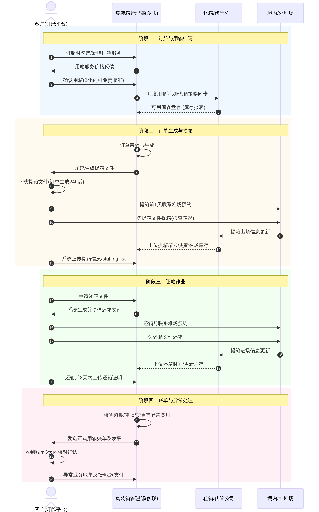
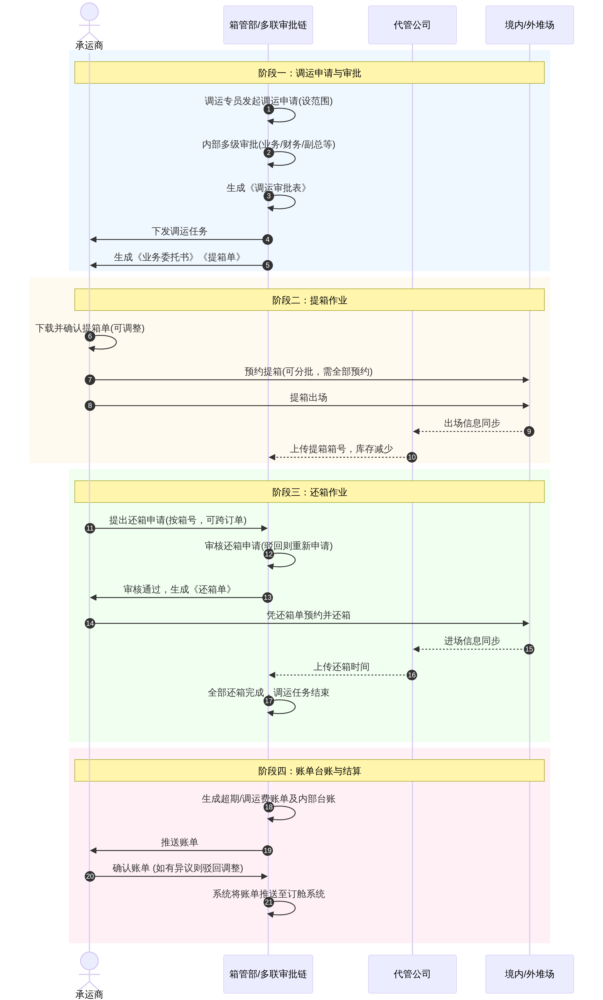
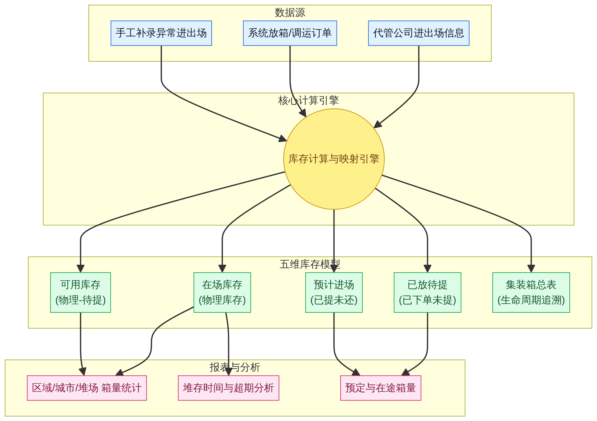

# 集装箱业务管理系统功能模块与用户角色说明书

> **文档版本**：V2.0（深度完善版）
> **编制依据**：《集装箱业务流程图doc.pdf》、《班列用箱申流程20211109-1.docx》、《调运业务需求说明-袁慧敏2022.10.25(修改).docx》、《集装箱系统库存模块设计思路.pptx》

---

## 第一章：系统概述

本系统面向中欧班列平台公司（以下简称"多联公司"）的集装箱全生命周期管理需求，覆盖**物流流转、信息协同、资金结算**三大主线。系统以集装箱管理部为核心枢纽，向上对接集装箱制造商与租赁商，向下协同客户、代管公司、承运商及境内外堆场，形成完整的业务闭环。

系统的核心业务场景包括：

| 业务场景 | 核心参与方 | 关键单据 |
| :--- | :--- | :--- |
| 班列客户用箱申请与提还箱 | 客户、集装箱管理部、代管公司、堆场 | 提箱单、还箱单、用箱账单 |
| 集装箱调运（境内外驳箱/返箱） | 箱管部、承运商、代管公司、堆场 | 调运审批表、业务委托书、提箱单、还箱单、调运费账单 |
| 集装箱库存管理与追溯 | 代管公司、集装箱管理部 | 集装箱总表、库存报表 |
| 集装箱供应计划（采购/租赁） | 集装箱管理部、制造商、租赁商 | 采购/租赁合同 |
| 集装箱维修管理 | 代管公司、集装箱管理部 | 修箱记录 |

---

## 第二章：用户角色与权限说明

### 2.1 角色总览

系统共定义以下六类用户角色，各角色的职责边界清晰，权限由系统根据角色自动匹配。

| 角色编号 | 角色名称 | 所属组织 | 角色类型 |
| :---: | :--- | :--- | :--- |
| R01 | 集装箱管理部业务专员 | 多联公司 | 内部核心操作角色 |
| R02 | 多联公司内部审批人员 | 多联公司 | 内部审批角色 |
| R03 | 客户（班列/多式联运/租箱） | 外部客户 | 外部服务对象 |
| R04 | 代管公司操作员 | 代管公司 | 供应链合作方 |
| R05 | 承运商操作员 | 承运商 | 供应链合作方 |
| R06 | 堆场操作员 | 境内/外堆场 | 现场作业方 |

---

### 2.2 角色详细说明

#### R01：集装箱管理部业务专员

集装箱管理部业务专员是系统的核心中枢角色，负责整个集装箱供应链的计划制定、调度协调、订单审核与异常处理。该角色在系统中拥有最高的业务操作权限，是连接客户、供应商与现场作业的关键节点。

**主要功能权限如下：**

在**用箱业务**方面，专员负责接收客户的用箱申请，对申请内容（提箱城市、还箱城市、数量、箱型等）进行审核，并根据当前库存与供箱策略给出价格反馈与确认。订单审核通过后，系统自动生成提箱文件并推送至客户。专员还需处理客户在提还箱过程中产生的各类异常，包括箱况异常、超期、箱损等，并在业务结束后核算异常费用账单。

在**调运业务**方面，专员负责发起调运申请，设定调运线路（提箱地、还箱范围）、调运原因、调运单价（随还箱范围变动）、调运数量及用箱期等关键参数。调运申请经内部审批通过后，专员将调运任务下发给指定承运商，并全程跟踪任务执行状态。专员还负责审核承运商提交的还箱申请，审核通过后系统自动生成还箱单。调运任务结束后，专员可查看并下载《超期费账单》、《调运费账单》，以及专属的《境外集装箱返箱业务台账》和《境内外集装箱驳箱业务台账》。

在**库存管理**方面，专员可查看五维库存台账（在场库存、可用库存、已放待提、预计进场、集装箱总表），进行异常进出场信息的手工补录，并通过库存分析报表进行多维度的数据分析与差异核对。

---

#### R02：多联公司内部审批人员

多联公司内部审批人员是调运业务审批链中的关键角色，共分五级，依次为**业务部门负责人、财务部门、副总、常务副总、总经理**。系统根据调运申请中的调运总价自动匹配所需的审批层级，无需人工干预。

**主要功能权限如下：**

审批人员可在系统中查看待审批的调运申请详情，包括计划调运时间、调运线路、调运原因、调运单价、超期费标准、调运数量、承运商、调运总价等字段。审批人员可选择**通过**或**驳回**，驳回时需填写驳回原因。任一层级驳回后，申请将回退至发起人，整个审批流程终止。全部层级审批通过后，系统自动生成《调运审批表》，并触发后续任务下发流程。

---

#### R03：客户（班列客户、多式联运客户、租箱客户）

客户是系统对外服务的主要对象，通过订舱平台（如 `https://www.xaport.net`）与集装箱管理系统进行交互。客户分为班列用箱客户、多式联运客户和纯租箱客户，三类客户的核心操作流程基本一致，但在订舱集成方式上略有差异。

**主要功能权限如下：**

在**申请阶段**，客户可在订舱时勾选用箱服务，或在订舱完成后新增用箱服务。申请时需准确填写提箱城市、还箱城市、数量、箱型等信息（系统要求信息必须准确）。申请提交后，系统将反馈用箱服务价格，客户确认后订单生成。订单生成后24小时内可免责取消；超出24小时取消则需承担订单取消费，具体费用标准按合同执行。

在**提箱阶段**，客户需在订单生成24小时后及时登录系统下载提箱文件。提箱前1天需与提箱文件指定堆场联系沟通提箱时间。提箱时必须对箱况进行检查，确认箱况良好后完成提箱；如有异常，需电话联系箱管业务人员处理。提箱完成后，客户需在系统上传提箱信息及 stuffing list 信息。

在**还箱阶段**，客户需在还箱前自行从系统下载还箱文件，并与还箱文件指定堆场联系沟通还箱时间。完成还箱后3天内，客户需向订舱系统上传还箱证明文件。

在**账单阶段**，客户完成提箱后，系统生成正式用箱账单及发票，客户按合同约定支付用箱费用。完成还箱后，如产生超期费、箱损费、用箱变更费等异常费用，多联公司将向客户发送异常费用账单。客户应在收到账单后3天内核对确认或反馈异议；超过3天未反馈，系统默认客户已确认。

---

#### R04：代管公司操作员

代管公司是集装箱资产的实际托管方，负责集装箱的日常堆存管理与库存数据维护，是系统库存准确性的核心保障。

**主要功能权限如下：**

代管公司操作员可通过系统上传集装箱进出场信息，包括放箱业务、调运业务及其他异常进出场记录，系统将自动将这些信息映射至对应订单，并更新库存台账。在调运业务中，代管公司负责上传提箱箱号（触发库存减少）和还箱时间（触发库存增加）。代管公司还可下载提箱单（与多联公司国内业务部、承运商共享下载权限）。此外，代管公司需按约定的时间节点上传数据，以减少系统与实际库存之间的差异。

---

#### R05：承运商操作员

承运商是调运业务的实际执行方，负责集装箱的物理搬运与提还箱操作。

**主要功能权限如下：**

承运商操作员可在系统中接收并确认调运任务，下载《业务委托书》与《提箱单》。若对提箱单内容有异议，可在系统中进行调整。提箱预约支持一次性全部预约或分批多次预约，但系统强制要求最终必须将调运任务中的所有集装箱全部完成预约提箱。

提箱完成后，承运商以集装箱号为维度发起还箱申请（支持跨订单申请）。还箱申请经箱管部审核通过后，承运商下载《还箱单》并向指定堆场预约还箱，完成实际还箱操作。

调运任务结束后，承运商可查看并下载《超期费账单》和《调运费账单》，并对账单进行确认。若有异议，可驳回账单，由箱管部调整后再次确认。最终确认后，系统自动将账单推送至订舱系统。

---

#### R06：堆场操作员

堆场操作员是集装箱物理流转的最终执行者，负责现场的提还箱作业与箱况检查。

**主要功能权限如下：**

堆场操作员接收来自客户或承运商的提还箱预约通知，按照预约时间执行提还箱操作。提箱时需进行箱况检查，并将出场信息同步给代管公司。还箱时接收集装箱入场，并将进场信息同步给代管公司。如发现箱况异常，需及时记录并反馈至代管公司和集装箱管理部。

---

## 第三章：系统功能模块深度设计

### 3.1 模块总览

系统共划分为四大功能模块，各模块之间通过统一的数据总线进行信息交互。

| 模块编号 | 模块名称 | 主要服务对象 | 核心价值 |
| :---: | :--- | :--- | :--- |
| M01 | 客户服务与订舱协同门户 | 客户（R03） | 提供标准化的线上用箱申请与自助服务能力 |
| M02 | 核心业务与调运管理系统 | 箱管部（R01）、审批人员（R02）、承运商（R05） | 支撑调运全流程的数字化管理与多级审批 |
| M03 | 资产与多维库存管理系统 | 箱管部（R01）、代管公司（R04） | 建立准确、可追溯的五维库存体系 |
| M04 | 堆场作业与模板配置中心 | 代管公司（R04）、堆场（R06）、承运商（R05） | 标准化单据模板与现场作业数字化 |

---

### 3.2 M01：客户服务与订舱协同门户

该模块是系统面向外部客户的核心入口，与订舱平台深度集成，提供从用箱申请到账单支付的全流程自助服务能力。

**功能点 M01-F01：用箱申请与订舱集成**

系统支持两种用箱申请入口：其一是在订舱时直接勾选用箱服务，将用箱申请与订舱操作合并完成；其二是在订舱完成后，通过"新增用箱服务"功能补充申请。申请时，客户需填写提箱城市、还箱城市、数量、箱型等关键信息，系统对必填字段进行强校验，确保信息准确性。申请提交后，系统将根据当前库存与价格策略自动反馈用箱服务价格，客户确认后订单正式生成。

**功能点 M01-F02：订单管理与取消规则控制**

系统维护完整的订单生命周期状态，包括"待确认"、"已确认"、"已取消"、"提箱中"、"已完成"等状态。订单取消规则由系统自动判断：订单生成后24小时内取消为免责取消，不产生费用；超出24小时取消则系统自动标记为"超时取消"，并按合同约定触发取消费计算逻辑。

**功能点 M01-F03：单据下载与证明上传**

订单生成24小时后，客户可在系统中下载提箱文件。系统支持按订单号维度下载对应的提箱单，并提供提箱单有效期校验。还箱前，客户可自行从系统下载还箱文件。提箱完成后，客户需在系统上传提箱信息及 stuffing list 信息；还箱完成后3天内，客户需上传还箱证明文件，系统对上传时限进行监控并发出提醒。

**功能点 M01-F04：账单查看与异常费用管理**

系统在客户完成提箱后自动生成正式用箱账单及发票，并推送至客户账单中心。完成还箱后，如产生超期费、箱损费、用箱变更费等异常费用，系统将生成异常费用账单并推送至客户。客户可在账单中心查看账单详情，并在3天内进行确认或提出异议。系统对账单确认时限进行监控，超时未反馈则自动更新账单状态为"已确认"。

---

### 3.3 M02：核心业务与调运管理系统

该模块是集装箱管理部日常操作的核心平台，覆盖调运申请发起、多级审批、任务下发、提还箱单据管理及账单结算全流程。

**功能点 M02-F01：调运申请发起**

调运专员在系统中发起调运申请时，需填写以下关键字段：计划调运时间、调运线路（提箱地、还箱范围）、调运原因、调运单价（随还箱点范围变动）、用箱期、超期费标准、调运数量、指定承运商等。系统支持调运单价与还箱范围的联动配置，即不同还箱范围对应不同单价，由系统自动计算调运总价。

**功能点 M02-F02：多级动态审批引擎**

系统内置多级动态审批引擎，根据调运申请的调运总价自动匹配审批层级。审批层级共五级，依次为业务部门负责人、财务部门、副总、常务副总、总经理。系统自动将审批任务推送至对应审批人的待办列表，审批人可在系统中查看申请详情并进行通过或驳回操作。任一层级驳回后，申请回退至发起人，流程终止。全部层级审批通过后，系统自动生成《调运审批表》，内容包含所有审批字段及多级签字栏位，支持打印与导出。

**功能点 M02-F03：任务下发与承运商协同**

调运申请审批通过后，箱管部专员将调运任务下发给指定承运商，系统自动生成《业务委托书》和《提箱单》。提箱单包含提箱单号、数量、箱型、提箱地址、堆场联系方式、车牌号、司机联系方式、预约提箱时间等字段，并自动带入标准注意事项（包括有效期内提箱、提前预约、箱况检查、超期费标准等）。代管公司、多联公司国内业务部、承运商均可下载提箱单。承运商若对提箱单有异议，可在系统中进行调整。提箱预约支持一次性全部预约或分批多次预约，系统强制校验：最终必须将调运任务下所有集装箱全部完成预约提箱，方可进入还箱阶段。

**功能点 M02-F04：还箱申请与审核**

承运商以集装箱号为维度发起还箱申请，系统支持跨订单申请（即一个还箱申请中可包含来自不同调运订单的集装箱）。箱管部专员在系统中审核还箱申请，若审核不通过，申请作废并通知承运商重新发起；若审核通过，系统自动生成《还箱单》，内容包含还箱单号、还箱城市、还箱堆场、箱号、堆场地址及联系方式、预约还箱时间等字段，并带入标准注意事项（包括提前24小时邮件通知、通知内容要求、工作时间等）。

**功能点 M02-F05：账单台账与结算推送**

调运任务结束（即所有集装箱均完成还箱）后，系统自动生成以下单据：《超期费账单》（箱管部和承运商均可查看下载）、《调运费账单》（箱管部和承运商均可查看下载）、《境外集装箱返箱业务台账》（仅箱管部可查看）、《境内外集装箱驳箱业务台账》（仅箱管部可查看）。如集装箱需要修理，系统触发修箱流程。账单推送至承运商后，承运商进行确认；若有异议可驳回，由箱管部调整后再次推送确认。最终确认后，系统自动将账单推送至订舱系统，完成资金流闭环。

---

### 3.4 M03：资产与多维库存管理系统

该模块针对现有系统库存管理的四大痛点（异常进出场无法录入、缺少追溯记录、堆场信息无法修改、数据频次差异）进行全面重构，建立准确、可追溯的五维库存体系。

**功能点 M03-F01：五维库存台账**

系统建立五个相互关联的库存维度，形成完整的库存视图：

| 库存维度 | 定义 | 统计维度 | 数据来源 |
| :--- | :--- | :--- | :--- |
| 在场库存 | 实时物理库存（当前实际在堆场的集装箱数量） | 区域、城市、堆场、代管公司 | 代管公司上传进出场信息 |
| 可用库存 | 物理库存 - 已放待提 | 区域、城市、堆场、代管公司 | 系统计算 |
| 已放待提 | 客户已下单但尚未提箱的集装箱数量 | 区域、城市、堆场、代管公司、提箱单号、数量 | 系统从业务订单提取 |
| 预计进场 | 客户已提箱但尚未还箱的集装箱数量 | 区域、城市（堆场待定） | 系统从业务订单提取 |
| 集装箱总表 | 所有集装箱的日常进出场信息记录，用于全生命周期追溯 | 箱号、进出场时间、堆场、关联订单 | 汇总代管公司录入的全部进出场信息 |

**功能点 M03-F02：库存数据映射与计算引擎**

系统接收代管公司上传的进出场信息后，自动将进出场记录映射至对应的放箱订单或调运订单，并据此更新各维度库存数据。对于未能成功映射的箱号，系统将其标记并归入异常排查池，供箱管部人员进行人工核查与处理。系统支持在订单层面切换集装箱属性（自有箱/租赁箱），解决原有系统订单生成后无法切换的问题。

**功能点 M03-F03：异常进出场管理**

针对现有系统无法处理异常进出场的问题，系统提供以下能力：支持业务人员手工补录未在新系统生成的订单进场记录；支持独立的出场信息录入功能，不再依赖删除设备管理数据的方式；支持调运模块的库存统计，将调运业务产生的进出场纳入统一库存管理。

**功能点 M03-F04：库存分析报表**

系统提供以下三组标准化库存分析报表：

第一组为**箱量统计报表**，按区域、城市、堆场维度展示可用箱量、实际在场箱量、总进场量、总出场量，支持时间范围筛选与数据导出。

第二组为**堆存时间分析报表**，按区域、城市、堆场维度展示平均堆存时间、最大堆存时间、最小堆存时间及超期堆存箱量，帮助管理人员识别库存积压风险。

第三组为**预定与在途箱量报表**，按区域、城市、堆场维度展示预定箱量（已放待提）与在途箱量（预计进场），辅助供箱计划制定。

**功能点 M03-F05：库存差异核对**

系统支持与代管公司数据的定期对账功能，通过约定的数据上传时间节点，对比系统库存数据与代管公司实际库存数据，生成差异报告，并支持人工核对与修正。

---

### 3.5 M04：堆场作业与模板配置中心

该模块为整个系统提供标准化单据模板、预约通知管理及堆场信息动态维护能力。

**功能点 M04-F01：单据模板引擎**

系统内置以下标准化单据模板，所有模板均支持动态字段映射、有效期控制与打印/导出：

| 单据名称 | 核心字段 | 使用场景 |
| :--- | :--- | :--- |
| 《调运审批表》 | 计划调运时间、调运线路、调运原因、调运单价、用箱期、超期费、调运数量、承运商、调运总价、经办部门/人、多级审批签字栏 | 调运审批通过后自动生成 |
| 《用箱业务委托书》 | 委托方信息、承运商信息、调运任务详情、双方盖章签字栏 | 调运任务下发时自动生成 |
| 《提箱单（Release Order）》 | 提箱单号、数量、箱型、提箱地址、堆场电话/邮箱、车牌号、司机联系方式、提箱确认人、预约提箱时间、注意事项 | 订单确认后/调运任务下发后自动生成 |
| 《还箱单（Empty Redelivery Instruction）》 | 还箱单号、还箱城市、还箱堆场、箱号、堆场地址/电话/邮箱、预约还箱时间、注意事项 | 还箱申请审核通过后自动生成 |
| 《超期费账单》 | 箱号、超期天数、超期费标准、超期费金额 | 调运任务结束后自动生成 |
| 《调运费账单》 | 调运线路、调运数量、调运单价、调运总价 | 调运任务结束后自动生成 |

**功能点 M04-F02：预约与通知管理**

系统支持提箱/还箱的时间窗口预约管理，并在关键时间节点自动发送通知。还箱预约规则要求：通知必须通过邮件发送，邮件内容需包含箱号、车辆与司机信息（姓名、身份证、电话）、参考单元编号及预计到达时间，且需至少提前24小时发送；系统对工作时间（周一至周五8:00-18:00）进行校验，超出工作时间的预约需提示用户。

**功能点 M04-F03：堆场信息动态维护**

系统支持在订单执行过程中，对提箱/还箱堆场信息进行动态修改，解决原有系统堆场信息无法修改导致库存不准的问题。堆场信息修改后，系统自动同步更新相关联的库存数据（已放待提、预计进场等维度）。

---

## 第四章：业务流程闭环

### 4.1 整体三流协同关系

系统以多联公司为核心，构建物流、信息流、资金流三流协同的业务网络。集装箱制造商与租赁商向平台公司提供集装箱资产（物流），平台公司向其支付采购/租赁费用（资金流），双方通过需求计划与供应信息进行信息交互（信息流）。平台公司向客户提供集装箱（物流），客户支付租箱费用（资金流），双方通过用箱需求与提还箱指令进行信息交互（信息流）。代管公司、调运供应商及境内外堆场作为执行层，负责集装箱的实际流转，并向平台公司反馈提还箱信息（信息流）。

### 4.2 班列用箱服务业务流程（泳道图）

下图展示了客户、集装箱管理部、代管公司、堆场四方协同的完整用箱服务流程闭环，涵盖申请、提箱、还箱、账单四个阶段。

**流程关键规则说明：**

| 规则编号 | 规则内容 |
| :---: | :--- |
| BR-01 | 客户下单前如有疑问可邮件咨询，原则上需在提箱前3天申请 |
| BR-02 | 提箱城市、还箱城市、数量等信息必须准确提交，系统进行强校验 |
| BR-03 | 订单生成后24小时内可免责取消；超时取消需承担取消费 |
| BR-04 | 订单生成24小时后，客户应及时下载提箱文件 |
| BR-05 | 提箱前1天需与指定堆场联系沟通提箱时间 |
| BR-06 | 提箱时必须检查箱况，提箱后换箱等费用由客户承担 |
| BR-07 | 提箱完成后，客户需在系统上传提箱信息及 stuffing list |
| BR-08 | 还箱前客户需自行下载还箱文件，并与指定堆场沟通还箱时间 |
| BR-09 | 还箱完成后3天内，客户需上传还箱证明文件 |
| BR-10 | 客户收到账单后3天内需确认或提出异议，超时默认确认 |

### 4.3 集装箱调运业务流程（泳道图）

下图展示了箱管部、多联公司审批链、承运商、代管公司、堆场五方协同的完整调运业务流程闭环，涵盖申请审批、任务下发、提箱、还箱、账单五个阶段。

**流程关键规则说明：**

| 规则编号 | 规则内容 |
| :---: | :--- |
| BR-11 | 调运申请中不指定单一还箱点，只给出还箱范围；调运单价随还箱点范围变动 |
| BR-12 | 审批层级由系统根据调运总价自动匹配，无需人工干预 |
| BR-13 | 提箱单支持一次性全部预约或分批多次预约，但最终必须完成全部集装箱的预约提箱 |
| BR-14 | 还箱申请以集装箱号为维度，支持跨订单申请 |
| BR-15 | 还箱申请审核不通过时，申请作废，承运商需重新发起 |
| BR-16 | 所有集装箱全部还箱完成后，调运任务自动结束，触发账单生成 |
| BR-17 | 账单最终确认后，系统自动将账单推送至订舱系统 |

### 4.4 五维库存管理模型关系图

下图展示了库存数据来源、计算引擎与五维库存台账及报表分析的关系。

---

## 第五章：系统集成与接口说明

### 5.1 与订舱平台的集成

系统需与外部订舱平台（如 `https://www.xaport.net`）进行双向集成。集成内容包括：接收订舱平台推送的用箱申请信息，向订舱平台推送用箱价格反馈与订单确认结果，以及在账单最终确认后将账单数据推送至订舱平台，完成资金流闭环。

### 5.2 与代管公司系统的数据对接

系统需与代管公司系统建立数据对接通道，约定进出场数据的上传时间节点与数据格式标准，以减少因数据更新频次差异导致的库存差异。

---

## 第六章：关键业务规则汇总

| 规则编号 | 所属模块 | 规则内容 |
| :---: | :--- | :--- |
| BR-01 | 用箱申请 | 提箱前3天申请，信息必须准确 |
| BR-02 | 订单取消 | 24小时内免责取消；超时取消承担取消费 |
| BR-03 | 提箱文件 | 订单生成24小时后下载；提箱前1天预约堆场 |
| BR-04 | 提箱操作 | 必须检查箱况；提箱后换箱费用客户承担 |
| BR-05 | 提箱上传 | 提箱完成后上传提箱信息及 stuffing list |
| BR-06 | 还箱文件 | 还箱前自行下载还箱文件 |
| BR-07 | 还箱证明 | 还箱完成后3天内上传还箱证明 |
| BR-08 | 账单确认 | 收到账单3天内确认或异议；超时默认确认 |
| BR-09 | 调运审批 | 审批层级由系统根据调运总价自动匹配 |
| BR-10 | 提箱预约 | 支持分批预约，但最终必须完成全部集装箱预约 |
| BR-11 | 还箱申请 | 以集装箱号为维度，支持跨订单申请 |
| BR-12 | 还箱通知 | 提前至少24小时邮件通知，需包含箱号、司机、车辆、预计到达时间 |
| BR-13 | 任务结束 | 全部集装箱还箱完成后，调运任务自动结束 |
| BR-14 | 账单推送 | 账单最终确认后，系统自动推送至订舱系统 |
| BR-15 | 库存切换 | 订单生成后支持切换自有箱与租赁箱属性 |
| BR-16 | 堆场修改 | 支持订单执行中修改提还箱堆场，并同步更新库存 |
| BR-17 | 异常补录 | 支持手工补录未在系统生成的订单进场记录 |
| BR-18 | 差异核对 | 系统与代管公司数据按约定时间节点进行对账 |

---

*本说明书基于以下原始需求文档综合编制：《集装箱业务流程图doc.pdf》、《班列用箱申流程20211109-1.docx》、《调运业务需求说明-袁慧敏2022.10.25(修改).docx》、《集装箱系统库存模块设计思路.pptx》。*
